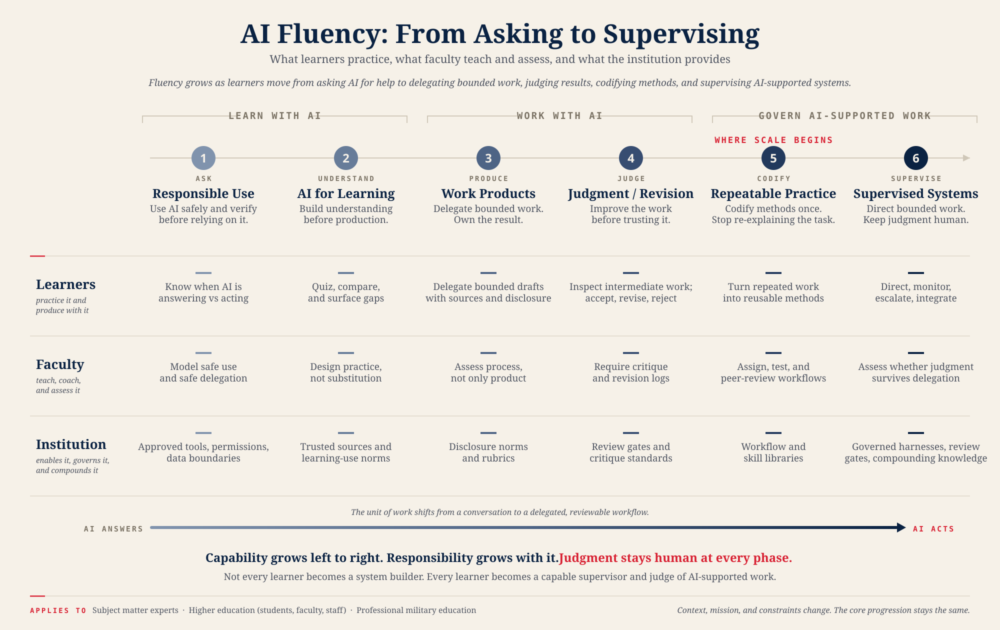
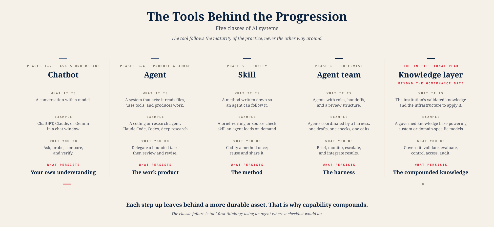
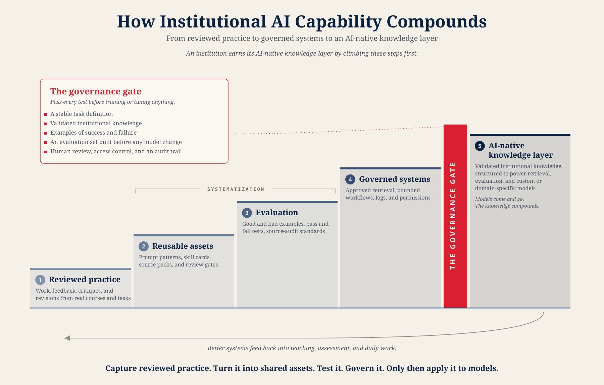
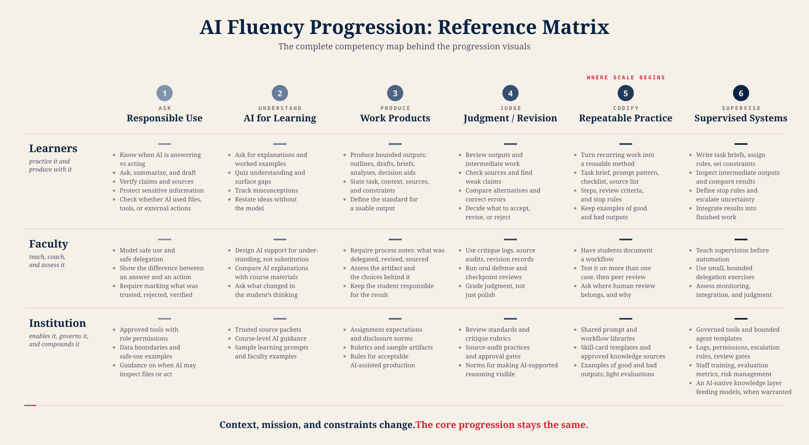

# The AI Fluency Progression

This document is the workbench's public rendition of the **Building AI Fluency** framework (Jack C. Shaw, July 2026). It carries the framework's three solid structures — the six-phase progression, the tool progression, and the compounding staircase — plus the reference matrix, which is published here as a **hypothesis under validation**, not settled doctrine.

The framework applies to subject matter experts, higher education, and professional military education. Context, mission, and constraints change. The core progression stays the same. One thread runs through everything: **judgment stays human at every phase.**

## The Six Phases

Fluency grows as learners move from asking AI for help to delegating bounded work, judging results, codifying methods, and supervising AI-supported systems. The unit of work shifts from a conversation to a delegated, reviewable workflow.

| # | Phase | Name | The move |
| --- | --- | --- | --- |
| 1 | Ask | Responsible Use | Use AI safely and verify before relying on it. |
| 2 | Understand | AI for Learning | Build understanding before production. |
| 3 | Produce | Work Products | Delegate bounded work. Own the result. |
| 4 | Judge | Judgment / Revision | Improve the work before trusting it. |
| 5 | Codify | Repeatable Practice | Codify methods once. Stop re-explaining the task. **Where scale begins.** |
| 6 | Supervise | Supervised Systems | Direct bounded work. Keep judgment human. |

Phases 1–2 are **learning with AI**. Phases 3–4 are **working with AI**. Phases 5–6 are **governing AI-supported work**. The ordering reflects the research: unguided AI use can raise performance without producing learning, so safe use and learning come before production, and production is paired with judgment. Not every learner becomes a system builder. Every learner becomes a capable supervisor and judge of AI-supported work.

## The Tools Behind The Progression

Five classes of systems, defined by what you do with them and **what remains when the work is done**.

| Tool | What remains when the work is done |
| --- | --- |
| Chatbot | Your understanding. |
| Agent | A work product. |
| Skill | A method. |
| Agent team | The harness — the structure of roles and review you supervised through. |
| AI-native knowledge layer | The institution's compounded knowledge. |

One warning: **the tool follows the maturity of the practice.** Reaching for an agent where a checklist would do is the most common failure.

## How Institutional Capability Compounds

The institutional argument runs as a staircase:

1. Reviewed practice becomes shared assets.
2. Shared assets make evaluation possible.
3. Evaluation makes governed systems trustworthy.
4. Passing the governance gate unlocks the payoff: every model the institution uses afterward draws on its own validated knowledge instead of starting over.

Models come and go. The knowledge compounds. The workbench's maturity levels already climb this staircase; see the Crosswalk below.

## The Reference Matrix

The matrix maps what learners practice, what faculty teach and assess, and what the institution provides, at every phase. It is the working document for course and program design.

**Read the status legend first.** Each persona row below carries a validation status. `Hypothesis` means the cells are research-informed but have not yet survived contact with NWC faculty use. Workbench templates carry short matrix checks (in the after-action note and calibration protocol) so routine use produces the evidence that confirms, revises, or strikes these cells.

### Learners — practice it and produce with it

Status: Hypothesis — awaiting NWC validation.

| Phase | Learners |
| --- | --- |
| 1 Ask | Know when AI is answering vs acting. Ask, summarize, and draft. Verify claims and sources. Protect sensitive information. Check whether AI used files, tools, or external actions. |
| 2 Understand | Ask for explanations and worked examples. Quiz understanding and surface gaps. Track misconceptions. Restate ideas without the model. |
| 3 Produce | Produce bounded outputs: outlines, drafts, briefs, analyses, decision aids. State task, context, sources, and constraints. Define the standard for a usable output. |
| 4 Judge | Review outputs and intermediate work. Check sources and find weak claims. Compare alternatives and correct errors. Decide what to accept, revise, or reject. |
| 5 Codify | Turn recurring work into a reusable method: task brief, prompt pattern, checklist, source list, steps, review criteria, and stop rules. Keep examples of good and bad outputs. |
| 6 Supervise | Write task briefs, assign roles, set constraints. Inspect intermediate outputs and compare results. Define stop rules and escalate uncertainty. Integrate results into finished work. |

### Faculty — teach, coach, and assess it

Status: Hypothesis — awaiting NWC validation.

| Phase | Faculty |
| --- | --- |
| 1 Ask | Model safe use and safe delegation. Show the difference between an answer and an action. Require marking what was trusted, rejected, verified. |
| 2 Understand | Design AI support for understanding, not substitution. Compare AI explanations with course materials. Ask what changed in the student's thinking. |
| 3 Produce | Require process notes: what was delegated, revised, sourced. Assess the artifact and the choices behind it. Keep the student responsible for the result. |
| 4 Judge | Use critique logs, source audits, revision records. Run oral defense and checkpoint reviews. Grade judgment, not just polish. |
| 5 Codify | Have students document a workflow. Test it on more than one case, then peer review. Ask where human review belongs, and why. |
| 6 Supervise | Teach supervision before automation. Use small, bounded delegation exercises. Assess monitoring, integration, and judgment. |

### Institution — enables it, governs it, and compounds it

Status: Hypothesis — awaiting NWC validation.

| Phase | Institution |
| --- | --- |
| 1 Ask | Approved tools with role permissions. Data boundaries and safe-use examples. Guidance on when AI may inspect files or act. |
| 2 Understand | Trusted source packets. Course-level AI guidance. Sample learning prompts and faculty examples. |
| 3 Produce | Assignment expectations and disclosure norms. Rubrics and sample artifacts. Rules for acceptable AI-assisted production. |
| 4 Judge | Review standards and critique rubrics. Source-audit practices and approval gates. Norms for making AI-supported reasoning visible. |
| 5 Codify | Shared prompt and workflow libraries. Skill-card templates and approved knowledge sources. Examples of good and bad outputs; light evaluations. |
| 6 Supervise | Governed tools and bounded agent templates. Logs, permissions, escalation rules, review gates. Staff training, evaluation metrics, risk management. An AI-native knowledge layer feeding models, when warranted. |

## Validation Status And Changelog

Statuses: `Hypothesis — awaiting NWC validation` | `Field-tested — evidence from NWC use` | `Revised` | `Struck`.

Evidence arrives through the matrix checks in the after-action note template and the faculty calibration protocol. Changes to matrix cells are recorded here.

| Date | Row / cell | Change | Evidence |
| --- | --- | --- | --- |
| 2026-07-08 | All rows | Published at Hypothesis status. | Initial rendition from the Building AI Fluency package. |

## Crosswalk

One table answers "where am I, and what do I use?" Start with the [phase placement diagnostic](../templates/phase-placement-diagnostic.md) if you do not know your phase.

### Templates To Phases

| Template | Primary phases | Matrix row it exercises |
| --- | --- | --- |
| [Phase placement diagnostic](../templates/phase-placement-diagnostic.md) | Entry point, all phases | Faculty |
| [Assignment design worksheet](../templates/assignment-design-worksheet.md) | 2–4 | Faculty |
| [Assessment and oral-defense rubric](../templates/assessment-and-oral-defense-rubric.md) | 4 | Faculty |
| [Flawed output library template](../templates/flawed-output-library-template.md) | 4 | Faculty, Institution |
| [Faculty calibration protocol](../templates/faculty-calibration-protocol.md) | 4–5 | Faculty, Institution |
| [Method card template](../templates/method-card-template.md) | 5 | Learners, Faculty |
| [Supervised delegation exercise](../templates/supervised-delegation-exercise.md) | 6 | Learners, Faculty |
| [Source kit template](../templates/source-kit-template.md) | 5–6 | Institution |
| [After-action note template](../templates/after-action-note-template.md) | 5 | Faculty, Institution |

### Maturity Levels To Phases And Staircase

| Workbench level | Phase(s) | Staircase step |
| --- | --- | --- |
| 1 Faculty Fluency Lab | Faculty practice phases 1–4 themselves | Reviewed practice |
| 2 Assignment Design | 2–3 | Reviewed practice |
| 3 Assessment Design | 4 | Reviewed practice |
| 4 Flawed Output Library | 4 | Shared assets |
| 5 Faculty Calibration | 4–5 | Evaluation |
| 6 Source Kits | 5–6 | Shared assets |
| 7 Institutional Memory (future) | 5, Institution row | Governed systems |
| 8 Context Curation (future) | 6, Institution row | Beyond the governance gate |

The workbench and the framework arrived at the same institutional shape independently: reviewed practice becomes shared assets, assets make evaluation possible, evaluation earns governed reuse. The maturity levels are the staircase, enacted.
